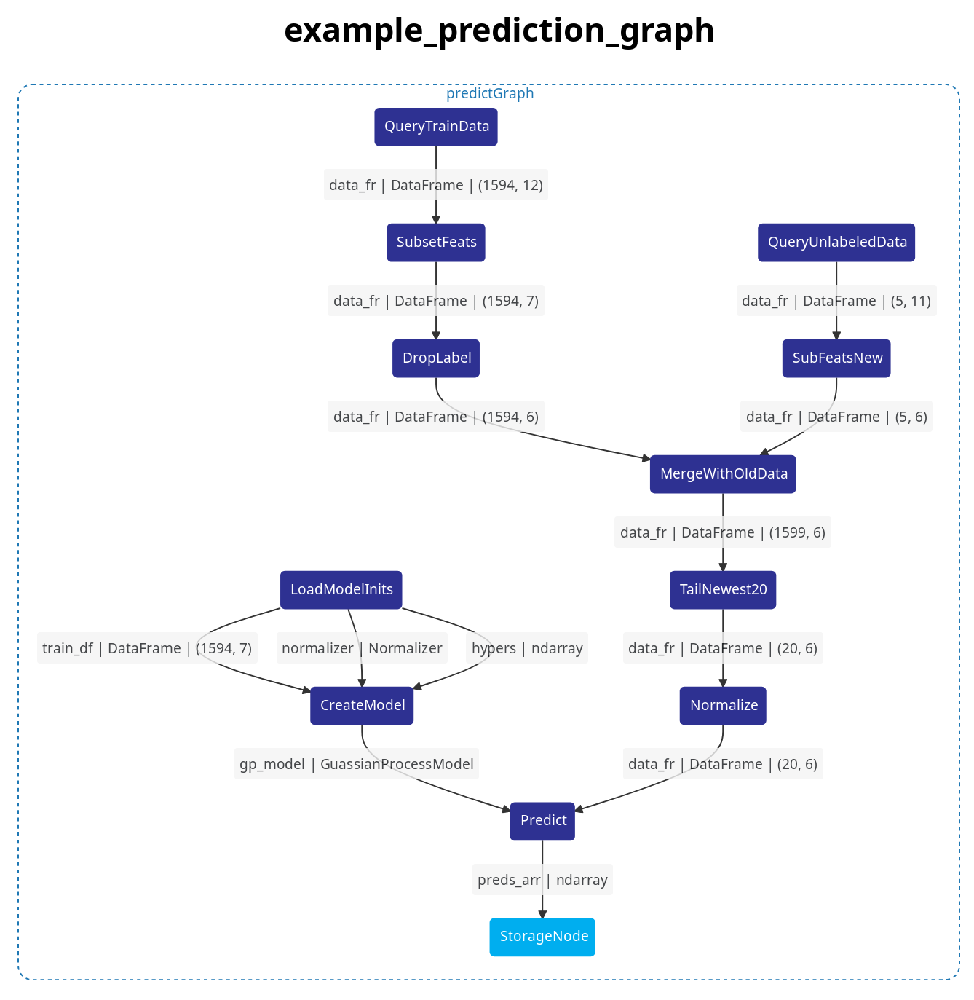

# graph-flow-vis *WIP*

Web applicaton to visualize complex pipelines, made with [dagre-d3](https://github.com/dagrejs/dagre-d3).
The core focus is to visualize [flowpipe](https://github.com/PaulSchweizer/flowpipe) graphs although we
aspire to support more graph import formats in the future.

## demo

Try the [demo](TODO) here.



## features

- easy inspection of graph and objects/values passed between nodes
- capable of handling large datasets
- also works with complex nested graphs

## getting started

install:
```
pip install -r requirements.txt --upgrade
```

run:
- `cd` to folder containing `app.py`, run:
```
FLASK_APP=app.py FLASK_ENV=development flask run --port 8889
```

Open localhost:8889 in your browser and click on the name of the graph you want to visualize.

## graph format

The web app expects graphs represented in the following json format:
```
 {
    "graph": {
        "name": "MainGraph",
        "nodes": [
            {
                "id": "some_node"
            },
            ...
        ],
        "edges": [
            {
                "source": "some_node",
                "target": "other_node",
                "label": "obj | type | info",
                "debug_file": "[PATH IS OPTIONAL]graph_data/MainGraph/some_node-[UUID]_obj.md"
            },
            ...
        ],
        "sub_graphs": [
            {
                "name": "MainGraph",
                "nodes_in_graph": [
                    "some_node",
                    "other_node",
                ],
                "parent": ""
            },
            {
                "name": "SubGraph",
                "nodes_in_graph": [
                    "sub_node_1",
                    "sub_node_2",
                ],
                "parent": "MainGraph"
            },
            ...
        ]
    }
}
```

All graph json files should be placed in `web_app/static/json`.
Optionally; in `web_app/graph_data` you can place markdown string representations of objects
that are passed between nodes. This can allow you to easily debug your pipeline.
These files should be markdown files with the following path:
```
graph_data/name_of_graph/source_node_id-[UUID]_edge_object_name.md
```
for example:
```
graph_data/DataGraph/QueryRecords-3503ceda-e8bb-4d34-98b6-1ea26c170c41_record_rows.md
```
Markdown tables are automatically rendered with custom css to make them easier on the eyes.

## Contributions

All contributions such as bugs, feature requests, additional examples or code improvements are welcome.
You are free to create an issue or pull request as long as you adhere to our [code of conduct](code-of-conduct.md).


